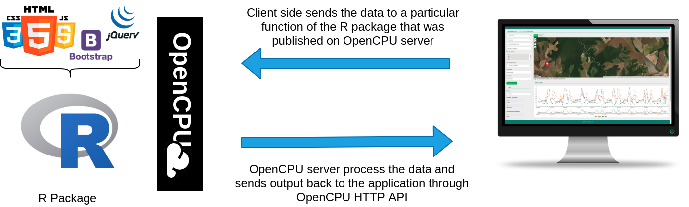

OpenCPU App: terrabrasilisTimeSeries (TerraBrasilis Time Series)
------------------

Simple OpenCPU Application. 

The overview of the OpenCPU application architecture is here:

<table width="700" border="0">
<tr>
<td align="center" valign="center">

Fig. 1. Application design using OpenCPU

</td>
</tr>
</table>

With a webhook, every push to Github will be mirrored onto the OpenCPU server. You can access the app on https://terrabrasilis.ocpu.io/terrabrasilis-timeseries/www/

## Prerequisites:

- Running [opencpu](https://www.opencpu.org/) server.

## Installation

    ## In R:

    install.packages("devtools")

    library(opencpu)
    ocpu_start_server("terrabrasilisTimeSeries")

    library(devtools)
    install_github("terrabrasilis/terrabrasilisTimeSeries")

    terrabrasilisTimeSeries::TSoperation(name_service = "WTSS-INPE", coverage = "MOD13Q1", longitude = -56.245043, latitude = -13.224772, bands = "EVI", start_date = "2004-02-14", end_date = "2018-05-12")
    
    # In a browser:
    http://localhost:5656/ocpu/library/terrabrasilisTimeSeries/www/

    ## In a terminal 
    
    # Or sends the specified data in a POST request to the OpenCPU server
    curl -v https://terrabrasilis.ocpu.io/terrabrasilis-timeseries/R/TSoperation/json -d 'name_service="WTSS-INPE"&coverage="MOD13Q1"&bands="evi"&longitude="-56"&latitude="-12"&start_date="2001-01-01"&end_date="2002-01-01"'

  
    
